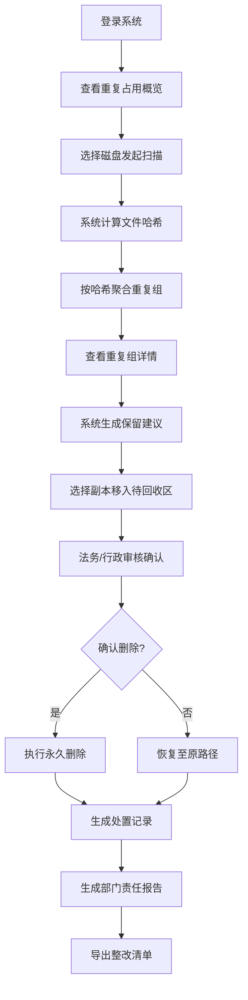

## 1. 产品概述

企业共享网盘哈希去重管理后台，面向行政、法务和部门资料管理员，提供公共盘重复文件的识别、处置和报告全流程管理。通过 SHA-256 哈希算法精准识别内容相同的文件（即使文件名不同），配合安全的双步处置流程，帮助企业清理冗余数据、降低存储成本、落实数据管理责任。

## 2. 核心功能

### 2.1 用户角色

| 角色 | 注册方式 | 核心权限 |
|------|----------|----------|
| 系统管理员 | 域账号登录 | 全盘扫描、全局处置、系统配置 |
| 部门资料管理员 | 域账号登录 | 部门盘扫描、部门内处置、查看报告 |
| 法务/行政审核员 | 域账号登录 | 回收确认、批量审批、报告导出 |

### 2.2 功能模块

1. **概览页**：重复占用概览仪表盘、快速扫描入口、最近活动记录
2. **重复组详情页**：哈希盘点结果、文件组列表、保留建议、移入待回收区操作
3. **回收确认页**：待回收文件列表、双步确认机制、批量清理操作
4. **责任报告页**：部门重复占用排行榜、整改清单、导出功能

### 2.3 页面详情

| 页面名称 | 模块名称 | 功能描述 |
|----------|----------|----------|
| 概览页 | 数据概览卡片 | 展示重复文件组数量、可节省空间、涉及部门数、最大重复来源 |
| 概览页 | 趋势图表 | 近30天重复文件变化趋势、各部门重复占比分布 |
| 概览页 | 快速扫描 | 选择部门盘/项目盘/归档盘发起哈希扫描 |
| 概览页 | 最近活动 | 展示最近的扫描、处置、确认操作记录 |
| 重复组详情页 | 筛选条件 | 按部门、文件类型、大小范围、重复次数筛选 |
| 重复组详情页 | 重复组列表 | 按哈希聚合的文件组，显示文件数、总大小、可节省空间 |
| 重复组详情页 | 文件详情 | 组内文件列表，展示路径、创建人、最近访问时间、保留建议 |
| 重复组详情页 | 处置操作 | 选择多余副本移入待回收区，支持批量操作 |
| 回收确认页 | 待回收列表 | 展示待确认删除的文件，含原路径、移入时间、操作人 |
| 回收确认页 | 确认机制 | 法务/行政二次确认，支持恢复或永久删除 |
| 回收确认页 | 批量操作 | 批量确认删除、批量恢复 |
| 责任报告页 | 部门排行榜 | 按重复占用空间排序的部门榜单 |
| 责任报告页 | 整改清单 | 各部门待清理文件明细，支持导出 Excel |

## 3. 核心流程

### 3.1 哈希盘点流程

管理员选择目标磁盘（部门盘/项目盘/归档盘），系统递归遍历目录计算每个文件的 SHA-256 哈希值，按哈希值聚合同内容文件组，生成盘点报告。

### 3.2 安全处置流程

管理员查看重复组详情，系统基于创建时间、访问频率、路径优先级给出保留建议，管理员选择多余副本移入待回收区，法务/行政审核员二次确认后执行删除。

### 3.3 流程图

## 4. 用户界面设计

### 4.1 设计风格

- **主色调**：深蓝 `#1e3a5f`，代表专业、稳重、可信赖
- **辅助色**：安全绿 `#10b981`（正常/保留）、警示橙 `#f59e0b`（待确认）、危险红 `#ef4444`（删除/警告）
- **中性色**：深灰 `#1f2937`、中灰 `#6b7280`、浅灰 `#f3f4f6`
- **按钮风格**：直角或微圆角（2px），实心填充，悬停时加深底色
- **字体**：标题使用 `思源黑体 Bold`，正文使用 `思源宋体 Regular`/`Inter`，数据展示使用等宽字体 `JetBrains Mono`
- **布局风格**：顶部导航 + 左侧菜单 + 内容区的经典后台布局，卡片式数据展示，表格为主
- **图标风格**：线性图标（Lucide React），保持统一粗细和风格

### 4.2 页面设计概述

| 页面名称 | 模块名称 | UI 元素 |
|----------|----------|---------|
| 概览页 | 数据概览卡片 | 4 张指标卡片，大数字展示，配有趋势小箭头和环比变化 |
| 概览页 | 图表区 | 两个并排图表：趋势折线图 + 部门占比环形图 |
| 概览页 | 扫描入口 | 卡片式磁盘选择，点击后显示扫描进度条 |
| 概览页 | 活动日志 | 时间轴式展示最近操作记录 |
| 重复组详情页 | 筛选栏 | 水平排列的筛选条件，下拉选择器 + 日期范围 |
| 重复组详情页 | 重复组列表 | 可展开的表格行，点击展开显示组内文件详情 |
| 重复组详情页 | 保留建议标签 | 绿色圆角标签标注建议保留的文件 |
| 重复组详情页 | 操作列 | 复选框 + "移入待回收区"按钮 |
| 回收确认页 | 统计栏 | 待确认数量、涉及空间、预计节省 |
| 回收确认页 | 待回收表格 | 橙色警示边框，包含恢复和确认删除操作 |
| 回收确认页 | 确认弹窗 | 二次确认对话框，需输入确认文字 |
| 责任报告页 | 排行榜 | 带排名序号的列表，前三名有特殊样式 |
| 责任报告页 | 整改清单 | 可筛选的部门清单，带导出按钮 |

### 4.3 响应性

采用桌面优先设计，主内容区最小宽度 1280px。在 1920px 及以上宽度时优化布局，增加信息密度。平板设备（≥768px）适配为侧边栏可折叠，手机端（<768px）仅提供核心数据查看功能。

### 4.4 动效设计

- 页面加载：数据卡片依次淡入，间隔 100ms
- 表格行展开：平滑高度过渡动画 300ms
- 扫描进度：线性进度条 + 百分比数字更新
- 按钮交互：悬停 0.2s 底色加深，点击 0.1s 缩放反馈
- 危险操作：红色按钮闪烁提示，确认弹窗缩放出现

### 4.5 专业审慎细节

- 所有删除操作均有明确的二次确认
- 数据展示精确到字节，时间精确到秒
- 操作日志不可删除、不可篡改
- 重要数字使用千分位分隔符
- 表格支持列排序和数据导出
