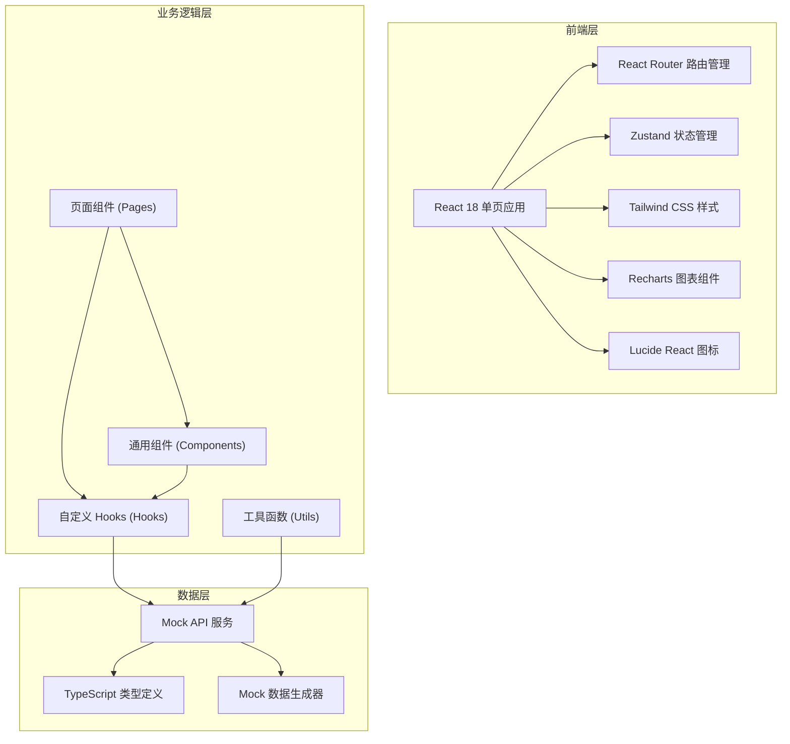
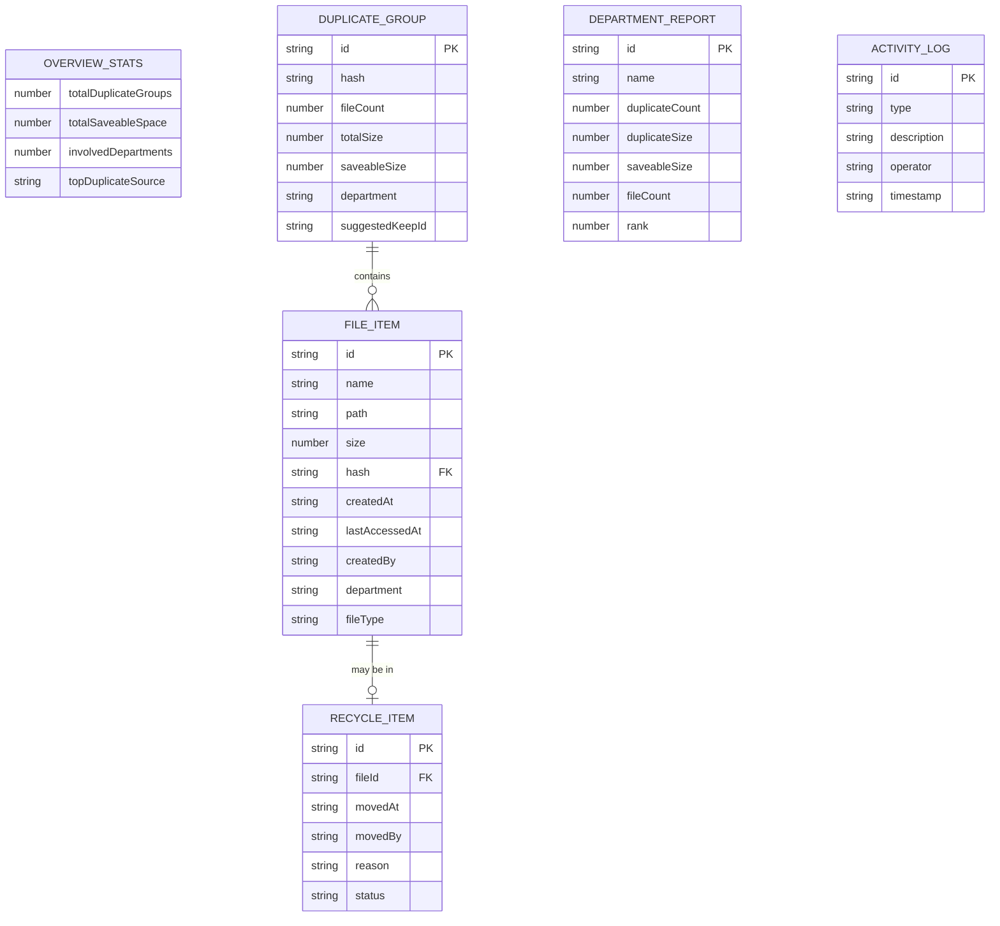

## 1. 架构设计



## 2. 技术描述

- **前端框架**: React 18 + TypeScript
- **构建工具**: Vite 5.x
- **路由管理**: React Router DOM 6.x
- **状态管理**: Zustand 4.x
- **样式方案**: Tailwind CSS 3.x
- **图表库**: Recharts 2.x
- **图标库**: Lucide React
- **包管理器**: npm
- **后端**: 无后端，使用 Mock 数据模拟 API 响应

## 3. 路由定义

| 路由 | 页面 | 说明 |
|------|------|------|
| `/` | 概览页 | 重复占用概览仪表盘 |
| `/duplicates` | 重复组详情页 | 哈希盘点结果列表 |
| `/recycle` | 回收确认页 | 待回收文件确认 |
| `/reports` | 责任报告页 | 部门排行榜和整改清单 |
| `*` | 404 页面 | 路由不存在时跳转 |

## 4. API 定义

### 4.1 类型定义

```typescript
// 文件信息
interface FileItem {
  id: string;
  name: string;
  path: string;
  size: number;
  hash: string;
  createdAt: string;
  lastAccessedAt: string;
  createdBy: string;
  department: string;
  fileType: string;
}

// 重复文件组
interface DuplicateGroup {
  id: string;
  hash: string;
  fileCount: number;
  totalSize: number;
  saveableSize: number;
  files: FileItem[];
  suggestedKeepId: string;
  department: string;
}

// 待回收文件
interface RecycleItem {
  id: string;
  fileItem: FileItem;
  movedAt: string;
  movedBy: string;
  reason: string;
  status: 'pending' | 'approved' | 'rejected';
}

// 部门报告
interface DepartmentReport {
  id: string;
  name: string;
  duplicateCount: number;
  duplicateSize: number;
  saveableSize: number;
  fileCount: number;
  rank: number;
}

// 概览统计
interface OverviewStats {
  totalDuplicateGroups: number;
  totalSaveableSpace: number;
  involvedDepartments: number;
  topDuplicateSource: string;
  trend: DailyTrend[];
  departmentDistribution: DepartmentDistribution[];
}

// 活动日志
interface ActivityLog {
  id: string;
  type: 'scan' | 'move' | 'approve' | 'reject' | 'delete';
  description: string;
  operator: string;
  timestamp: string;
}
```

### 4.2 Mock API 接口

| 接口 | 方法 | 说明 |
|------|------|------|
| `/api/overview` | GET | 获取概览统计数据 |
| `/api/activities` | GET | 获取最近活动日志 |
| `/api/duplicates` | GET | 获取重复文件组列表（支持筛选） |
| `/api/duplicates/:id` | GET | 获取单个重复组详情 |
| `/api/scan` | POST | 发起磁盘扫描 |
| `/api/recycle` | GET | 获取待回收列表 |
| `/api/recycle/move` | POST | 将文件移入待回收区 |
| `/api/recycle/approve` | POST | 确认删除 |
| `/api/recycle/reject` | POST | 恢复文件 |
| `/api/reports/departments` | GET | 获取部门排行榜 |
| `/api/reports/rectification` | GET | 获取整改清单 |

## 5. 数据模型

### 5.1 实体关系图



### 5.2 核心工具函数

```typescript
// 格式化文件大小
function formatFileSize(bytes: number): string;

// 格式化日期时间
function formatDateTime(date: string): string;

// 计算哈希（模拟）
function calculateHash(content: string): string;

// 生成保留建议
function generateKeepSuggestion(files: FileItem[]): string;

// 导出 Excel
function exportToExcel(data: any[], filename: string): void;
```

## 6. 项目结构

```
src/
├── components/          # 通用组件
│   ├── Layout/           # 布局组件
│   │   ├── Header.tsx
│   │   ├── Sidebar.tsx
│   │   └── index.tsx
│   ├── ui/             # UI 基础组件
│   │   ├── StatCard.tsx
│   │   ├── DataTable.tsx
│   │   ├── Modal.tsx
│   │   ├── Button.tsx
│   │   ├── Badge.tsx
│   │   └── ProgressBar.tsx
│   └── charts/         # 图表组件
│       ├── TrendChart.tsx
│       └── DonutChart.tsx
├── pages/             # 页面组件
│   ├── Overview.tsx
│   ├── Duplicates.tsx
│   ├── Recycle.tsx
│   ├── Reports.tsx
│   └── NotFound.tsx
├── store/             # 状态管理
│   └── useAppStore.ts
├── hooks/             # 自定义 Hooks
│   ├── useScan.ts
│   ├── useDuplicates.ts
│   └── useRecycle.ts
│   └── useReports.ts
├── utils/             # 工具函数
│   ├── format.ts
│   ├── mock.ts
│   └── export.ts
├── types/             # 类型定义
│   └── index.ts
├── App.tsx
├── main.tsx
└── index.css
```

## 7. 状态管理设计

### 应用状态使用 Zustand 管理，包含：

- `overview`: 概览统计数据
- `duplicates`: 重复文件组列表
- `recycleItems`: 待回收列表
- `activities`: 活动日志
- `reports`: 报告数据
- `loading`: 加载状态
- `currentScan`: 当前扫描进度
- `selectedItems`: 已选中的文件 ID 列表
